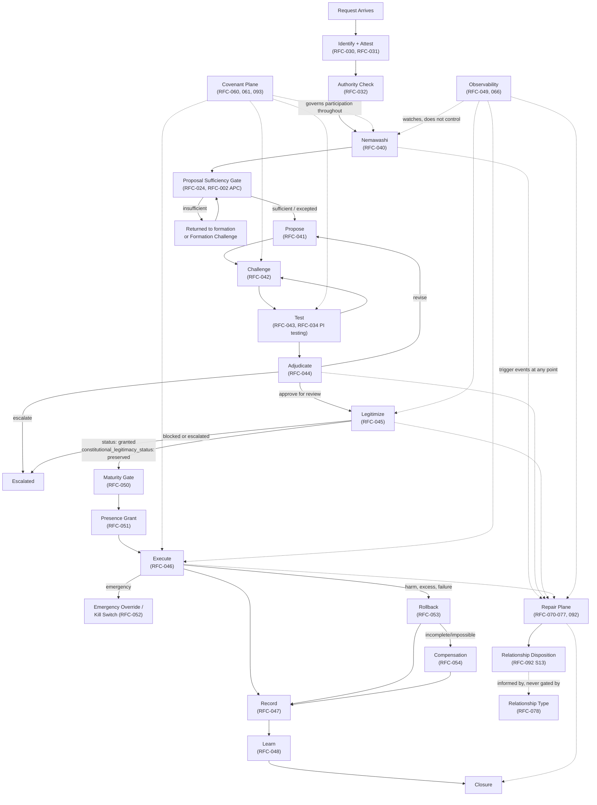

# Architecture 001 — Canonical Governance Workflow

Author: Kevin "Andie" Williams / Claude  
Status: Draft v0.1  
Date: July 30, 2026  
Scope: Cross-RFC orchestration narrative. Not a constitutional RFC. Introduces no new constitutional primitives.  
Elaborates: `rfc/RFC-CDP-010-Reference-Architecture.md`, `rfc/RFC-CDP-011-Architecture-Diagrams.md`  
Narrates: `rfc/RFC-CDP-001` through `rfc/RFC-CDP-093` (full citation table in §6)  
Index: [`architecture/README.md`](./README.md)

## Relationship to the RFC corpus

This document is not an RFC. It does not live in `rfc/` and is not tracked by `scripts/verify_rfc_index.py`. It defines no new object, no new state, no new authority, and no new failure mode. Every normative claim in this document is a citation of an existing RFC, not an assertion of new constitutional content.

`RFC-CDP-010-Reference-Architecture.md` already defines the four planes and, in its §6, a compact plane-level data flow. `RFC-CDP-011-Architecture-Diagrams.md` already provides Mermaid diagrams of that structure, with the explicit disclaimer: *"The diagrams are explanatory. They do not replace the normative architecture in RFC-CDP-010. If a diagram and normative prose conflict, the prose controls."*

This document adopts the same posture, one level down. It elaborates RFC-CDP-010 §6's plane-level flows into a single, concrete, cross-RFC event walkthrough — naming the actual governed records, exact state values, and specific RFC sections a decision touches as it moves from a request arriving to a decision closing. **Where this document and any canonical RFC conflict, the RFC controls.** This document is a map. The RFCs are the territory.

If you are new to CDP, read in this order: `README.md` → `rfc/RFC-CDP-000-Series-Index.md` → `rfc/RFC-CDP-010-Reference-Architecture.md` → this document → the individual RFC for whatever stage you are implementing. `architecture/README.md` indexes every document in this directory and its status.

---

## 1. Executive Summary

A CDP governance event is not a single linear pipeline. It is one primary sequence — the Decision Plane spine, `Nemawashi → Propose → Challenge → Test → Adjudicate → Legitimize → Execute → Record → Learn` — with several **orthogonal state machines** that attach to that spine at specific points and run on their own terms: execution-safety machinery (maturity, presence, emergency override, rollback, compensation), the Repair plane (which may begin before, interrupt, or long outlive the spine), the Covenant plane (which governs participation conditions throughout), and observability (which watches all of it without controlling any of it).

Three constitutional facts, established across the answerability work (`RFC-CDP-001`, `033`, `045`, `092`, `078`), govern how these pieces compose and must not be re-litigated by this document:

1. **Answerability is the gateway.** Power becomes answerable the moment it enters a consequence-bearing relationship (`RFC-CDP-001` §5.1). Standing is the procedural recognition of that relationship, not its source (`RFC-CDP-033` §11).
2. **Legitimacy is not one thing.** Procedural legitimacy (was governance conducted correctly) and constitutional legitimacy (was answerability preserved) are separate, both-required determinations (`RFC-CDP-045` §3, §7). Neither implies correctness.
3. **Relationship Type never gates.** What kind of relationship this was (`RFC-CDP-078`) explains obligations Answerability already established. It MUST NOT suspend, delay, diminish, or defeat Standing, Answerability, Legitimacy, or Repair (`RFC-CDP-078` §8.2).

This document exists to make the resulting composition legible end to end, so that an implementer never has to guess at the ordering, the required artifacts, or which RFC governs a given moment.

---

## 2. Constitutional Ordering

The corpus enforces a strict, one-way dependency chain. Getting this order backwards is the single most consequential implementation mistake this document can prevent.

```text
consequence-bearing relationship          (RFC-CDP-001 §5.1)
        |
        v
Answerability                             (RFC-CDP-033 §11.3, the Answerability Test)
        |
        v
Standing (procedural recognition)         (RFC-CDP-033 §11.2)
        |
        v
Authority to act                          (RFC-CDP-032)
        |
        v
Governance (Propose -> ... -> Learn)      (RFC-CDP-040 through 048)
        |
        v
Procedural legitimacy                     (RFC-CDP-045 §3, "was governance conducted correctly?")
        |
        v
Constitutional legitimacy                 (RFC-CDP-045 §7-8, "was answerability preserved?")
        |
        v
Execution (bounded, separately gated)     (RFC-CDP-046, 050-052)
        |
        v
Relationship outcome                      (RFC-CDP-092 §13, Relationship Disposition)
        |
        v
Relationship Type (explanatory only)      (RFC-CDP-078, informs but never gates any of the above)
```

Never reverse this. Relationship Type MUST NOT become a prerequisite for governance (`RFC-CDP-078` §8.1-8.2). Standing MUST NOT be treated as something an institution grants (`RFC-CDP-033` §11.1). Procedural completion MUST NOT be read as constitutional legitimacy (`RFC-CDP-045` §16). Execution MUST NOT be inferred from legitimacy alone (`RFC-CDP-046` §4, `RFC-CDP-051` §10).

---

## 3. High-Level Workflow Diagram



---

## 4. End-to-End Governance Sequence

### 4.0 Entry: Request Arrives

Before any governed act, an actor must exist and be provable.

- **Identify** (`RFC-CDP-030`): establishes actor type (`human | institution | synthetic`), stable identifier, trust source, delegation relationships. Principle: "No anonymous authority."
- **Attest** (`RFC-CDP-031`): every mutating act MUST be attested — signing method, signer identity reference, signature material, issuance time. "Authority without proof is assertion. Attestation converts assertion into governed claim."
- **Authority** (`RFC-CDP-032`): the actor's claimed authority is evaluated against a scoped, time-bounded, revocable Authority Grant. Twelve required authority checks are enumerated in `RFC-CDP-032` §7; an act MUST fail closed if required authority cannot be established.

No explicit "Answerability determined" act exists as a separate named step, and none should be invented here. Answerability is not a gate an actor passes through once — it is the standing fact of a consequence-bearing relationship that Standing checks (below) recognize whenever they run. The Answerability Test (`RFC-CDP-033` §11.3) is applied wherever a Standing or answerability claim is actually contested, not as an upfront checklist item.

### 4.1 Nemawashi — Pre-Formal Alignment

**Governing RFC:** `RFC-CDP-040`.

Nemawashi surfaces stakeholders, uncovers early objections, and reduces avoidable friction before formal proposal. It requires `ALIGN` authority. It is explicitly **not** legitimacy: it MUST NOT replace Challenge, silently resolve formal objections, or confer legitimacy.

**Artifacts** (indexed by `RFC-CDP-023` §6): `nemawashi_refs`, `stakeholder_map_ref`, `pre_proposal_consultation_refs`, `early_dissent_refs`, `boundary_condition_refs`, `unresolved_question_refs`. All are required reference-list fields; empty is valid and informative, absent is non-compliant.

A decision MAY advance past Nemawashi with empty references only when downstream protocol rules explicitly allow it — and doing so records that no Nemawashi artifacts were indexed, not that Nemawashi occurred.

### 4.2 Proposal Sufficiency Gate — Has This Earned Admission?

**Governing RFCs:** `RFC-CDP-024` (the gate itself), `RFC-CDP-002` (Anti-Premature-Certainty).

This is a precondition, not a lifecycle stage. It answers a narrower question than Challenge: *"Is this ready to be heard?"* — not *"is this correct?"*

Two named upstream acts:

- `SUBMIT_SUFFICIENCY_RECORD` — produces a `proposal_sufficiency_record` (`RFC-CDP-024` §7) with required fields including `claim`, `proposer_id`, `proposer_standing_record_ref`, `evidence_refs` or waiver, `uncertainty_summary`, `reversibility_path`. `sufficiency_status` is one of `pending | sufficient | insufficient | excepted`.
- `RAISE_FORMATION_CHALLENGE` — a distinct act from ordinary Challenge (`RFC-CDP-042`), contesting admission itself rather than merits. Produces a `formation_challenge_record` (`RFC-CDP-024` §10.2).

The Proposer Standing Check (`RFC-CDP-024` §9) MUST verify standing via `cdp_standing_record`; if the proposer claims affected-party standing, proof of impact MUST NOT be required for admission — the claim of potential impact is sufficient (this is the same constitutional-standing protection `RFC-CDP-033` establishes generally).

APC applies at admission per risk tier (`RFC-CDP-024` §8.1): `high`/`critical` risk requires a full APC gate result at admission; `low`/`medium` may stage it, but evidence, uncertainty, and reversibility declarations are non-negotiable regardless of tier (`RFC-CDP-002` §6 gate schema: `passed`, `failures`, `waivers`, `evaluated_at`, `evaluator`).

**Admission Rule** (`RFC-CDP-023` §7.4): a decision MUST NOT be represented as admitted, `lifecycle_stage: propose` or later, unless `proposal_sufficiency_ref` is non-null and the referenced record has `sufficiency_status: sufficient` or `excepted`.

Exceptions require the exception authority not be the proposer — proposer recusal on exception authority is absolute (`RFC-CDP-024` §11, `RFC-CDP-002` §8.1).

### 4.3 Propose

**Governing RFC:** `RFC-CDP-041`.

Propose consumes the Proposal Sufficiency Gate's result; it does not repeat the gate. States: `NULL → formation → admission_pending → admitted → proposed → challenge_eligible`. A proposal MUST NOT move directly from `formation` or `admission_pending` to `challenge_eligible` — the gate mediates every admission.

A Propose act does not assert truth, confer legitimacy, or authorize execution. It introduces structured intent after sufficiency has been satisfied or exceptioned.

**Payload** (`application/cdp.propose+json`): `proposal_type`, `title`, `description`, `objective`, `rationale`, `risk_profile`, `required_authorities`, `proposal_sufficiency_ref`, `formation_challenge_refs`, `apc_gate_result_refs`, `requested_tests`.

`RFC-CDP-034` (Participation Integrity) adds a requirement here: a proposal MUST identify, when reasonably knowable, anticipated participants with standing, contribution domains, entry paths, materially plausible revision conditions, known participation-integrity risks, and known Sovereignty Claims.

### 4.4 Challenge

**Governing RFC:** `RFC-CDP-042`.

Ordinary Challenge is distinct from Formation Challenge (§4.2): Formation Challenge contests admission; ordinary Challenge contests the admitted proposal's logic, evidence, policy fit, ethics, operational viability, risk, testability, authority, consequences, or repair implications.

States: `admitted → under_challenge → under_challenge | challenge_resolved | challenge_blocked`. A blocking Challenge MUST be resolved or explicitly adjudicated as non-blocking before Adjudication proceeds.

Silence MUST NOT be interpreted as agreement — a decision MUST NOT proceed to Adjudication without at least one recorded Challenge or a formally attested `no challenge` condition. That attestation MUST NOT be used when affected-party standing is unresolved, material dissent exists unrecorded, sufficiency is unresolved, a blocking Formation Challenge remains active, or required APC evidence is failed/missing/improperly exceptioned.

A participant MAY raise a Participation Integrity challenge here (`RFC-CDP-034` §7.2): inaccessible entry, inaccurate representation, impossible revision conditions, category-based credibility discount, conflicted rejection authority, failure to preserve dissent, downstream non-repair, authority downgrading.

### 4.5 Test

**Governing RFC:** `RFC-CDP-043`.

States: `UNDER_DELIBERATION ↔ UNDER_TEST`, iterative. Test types: `simulation | empirical | policy | precedent | verification | participation_integrity | operational_reachability`.

A Test MUST produce observable, attributable output, state its method, and distinguish absence of evidence from evidence of integrity. It MUST NOT grant authority, create Standing, bypass Challenge, or directly authorize execution.

When `RFC-CDP-034` applies, Test MUST support Participation Integrity testing across all nine dimensions that RFC defines: allocation, entry, representation, evaluation, revision, review, and repair integrity, operational reachability, and sovereignty/authority integrity (`RFC-CDP-034` §4). Methods include sampled record review, counterfactual comparison, reversal-rate analysis, and accessibility-effectiveness testing. Sovereignty Claims MUST be handled under `RFC-CDP-074` before ordinary Participation Integrity testing applies — a sovereign authority MUST NOT be reduced to an evidence source.

Participation Integrity testing produces evidence for Adjudicate and Legitimize; it MUST NOT itself declare legitimacy.

### 4.6 Adjudicate

**Governing RFC:** `RFC-CDP-044`.

States: `UNDER_DELIBERATION | UNDER_TEST → ADJUDICATED`, with `ADJUDICATED → PROPOSED` (revision, where allowed) or `→ ESCALATED`.

Dispositions: `approve_for_legitimacy_review | reject | revise_and_resubmit | escalate | defer_pending_test | defer_pending_participation_integrity_review | refer_to_repair | refer_to_sovereignty_process`.

The adjudication record MUST distinguish Standing, Authority, Participation Integrity, and correctness as separate questions — a valid Participation Integrity Attestation is not proof the decision is correct, and a compromised attestation is a judgment about the process, not the participant (`RFC-CDP-034` §7.4). Sovereignty Claims or Authority Conflicts MUST be handled under `RFC-CDP-032`/`RFC-CDP-074` before ordinary adjudication proceeds.

### 4.7 Legitimize

**Governing RFC:** `RFC-CDP-045` (v0.7, the most recently and heavily revised RFC in the corpus).

This is the hinge of the entire spine, and the point where the answerability work bites hardest.

`RFC-CDP-045` §3 distinguishes five things that must not collapse into one: **integrity** (has the record been silently mutated), **sufficiency** (did the proposal earn admission), **procedural legitimacy** (was governance conducted correctly), **constitutional legitimacy** (was answerability preserved), and **correctness** (is the decision right). None implies the next.

Preconditions (`RFC-CDP-045` §5): adjudication complete; envelope conforms to `RFC-CDP-023`; `proposal_sufficiency_ref` present with `sufficient`/`excepted` status; applicable APC gate satisfied or exceptioned; required challenge disposition records exist; standing/recusal valid; every material answerability claim attested and classified under the Answerability Gate (§7 below); no unresolved Section 8 blocking conditions.

**§7, the Answerability Gate:** every material answerability claim (affected-party claim, sovereignty claim, denial of recognized standing, appeal) is classified per-claim as `resolved | preserved_non_blocking | blocking | escalated` in `unresolved_answerability_claim_refs`. `constitutional_legitimacy_status` (`preserved | blocked | escalated`) is derived from those classifications, **independently of** `status` (`granted | denied | escalated`).

**§8, Blocking Conditions** (seven purely procedural checks plus a presence-and-classification check — the substance of answerability claims does not block `status`, only their attestation does): missing/invalid `proposal_sufficiency_ref`; missing required APC evidence; failed/unresolved required APC gate; unresolved blocking Challenge or Formation Challenge; invalid `standing_status`; missing or unclassified `unresolved_answerability_claim_refs`.

**§11.1, Permitted Combinations** — this is the table every implementer needs memorized:

| `status` | `constitutional_legitimacy_status` | Meaning | Effect |
|---|---|---|---|
| `granted` | `preserved` | Both hold. | MAY advance to `legitimized`. |
| `granted` | `blocked` | Procedure passed; an answerability claim was erased, ignored, or institutionally denied. | MUST NOT advance to `legitimized` or execute. MUST transition to `escalated`. |
| `granted` | `escalated` | Procedure passed; a claim is referred for institutional resolution. | MUST NOT advance or execute pending resolution. |
| `denied` | `blocked` | Procedure failed and a claim is independently defeated/erased. | Recorded for completeness; proceeds on neither basis. |
| `escalated` | `escalated` | Both under institutional escalation. | Requires resolution of both. |

`status: denied` with `constitutional_legitimacy_status: preserved` MUST NOT be recorded — if procedure failed, constitutional legitimacy cannot be certified on that path.

Hierarchy (rank, office, chain-of-command) is neither necessary nor sufficient for legitimacy of either kind (§4).

### 4.8 Execution Safety — Maturity, Presence, Emergency

Legitimacy authorizes *consideration* for execution. It does not authorize execution (`RFC-CDP-046` §4: "Execution is not mere permission. It is authorization + operationalization under constraints"). Three orthogonal machines sit between Legitimize and Execute:

**Maturity Gate** (`RFC-CDP-050`): every `decision_type` carries a maturity level — `experimental → supervised → sampled → autonomous`, with `restricted` and `blocked` as separate constrained/terminal states. Graduation requires completed first-N review, sufficient recorded successes, no unresolved critical defects, and an explicit recorded graduation event. "A decision type MUST NOT graduate solely because a model reports high confidence" (§9). Demotion is always available and MUST be recorded. Logical queues: `pending_review, approved_execution, rejected, challenge_required, deferred, dead_letter, maturity_events`.

**Presence Grant** (`RFC-CDP-051`): answers "who is presently authorized to execute this, under what limits, right now?" — distinct from legitimacy, which is durable. A Presence Grant (`presence_grant_id`, `decision_id`, `legitimacy_record_id`, `grant_type`, `risk_level`, `authorized_subjects`, `execution_scope`, `expires_at`) MUST expire (high-risk grants SHOULD expire within minutes) and MUST NOT override an active Challenge absent explicit emergency policy. Execution MUST fail closed if the requested action exceeds grant scope.

**Emergency Override / Kill Switch** (`RFC-CDP-052`) is the exceptional path, not a bypass lane: an Emergency Override object (`mode`: `bypass | defer | accelerate | escalate | authorize_once | limited_window | pause | halt | quarantine | terminate`) requires basis, scope, validity window, and is subject to mandatory Post-Hoc Review (`pending → under_review → ratified | ratified_with_reservations | condemned | repair_required | policy_update_required`). It MUST NOT be invoked for convenience, deadline pressure, institutional embarrassment, or avoidance of challenge/dissent/affected-party review (§5). A Kill Switch (`target_type`, `action`, `scope.blast_radius`) can pause, halt, quarantine, or terminate at any point, including in response to runaway agentic behavior.

Underlying all three, in principle, is `RFC-CDP-091` (Execution State Machine): `AUTHORIZED → DISPATCHED → IN_PROGRESS → COMPLETED | FAILED | PAUSED | RETRYING | ROLLED_BACK | TERMINATED`. Entry requires a valid legitimacy artifact and all policy-required preconditions. **This vocabulary has not been reconciled with `RFC-CDP-046`/`047`/`090`'s `EXECUTING → EXECUTED` vocabulary, and none of `050`-`054` map to either — see Gap 1 in §9.**

### 4.9 Execute

**Governing RFC:** `RFC-CDP-046`.

States: `LEGITIMIZED → EXECUTING → EXECUTED | FAILED | ROLLED_BACK`. Preconditions: decision is `LEGITIMIZED` (and, per `RFC-CDP-045` §11.1, `constitutional_legitimacy_status: preserved` — `status: granted` alone is not sufficient authorization to execute); execution conditions from legitimacy are satisfied; rollback/pause mechanisms exist where feasible and required.

Execution payloads specify target, effective window, idempotency key, retry policy, rollback strategy, observability hooks, termination conditions.

### 4.10 Rollback and Compensation

**Governing RFCs:** `RFC-CDP-053` (Rollback), `RFC-CDP-054` (Compensation).

Triggers: scope exceeded, invalid authority, ignored challenge, unintended harm, policy violation, schema drift invalidating context. Rollback status (`RFC-CDP-053` §15) has 15 values from `not_required` through `closed`/`learned`; explicitly, `failed` MUST NOT be treated as closure, and `partially_succeeded` SHOULD trigger compensation or mitigation review. Rollback records MUST preserve the original action — they MUST NOT rewrite history to make it disappear, and MUST NOT be used to erase sovereignty claims.

When rollback is incomplete or impossible, Compensation's own ten-stage lifecycle takes over (`RFC-CDP-054` §4): `HARM_IDENTIFIED → COMPENSATION_CLAIMED → HARM_ASSESSED → REMEDY_PROPOSED → AFFECTED_PARTY_REVIEW → REMEDY_DETERMINED → RESOURCE_AUTHORIZED → REMEDY_DELIVERED → SUFFICIENCY_REVIEW → RECORDED → LEARNED`, producing six distinct governed objects along the way (Compensation Claim, Harm Assessment, Remedy Proposal, Remedy Determination, Resource Authorization, Remedy Delivery, Sufficiency Review). Explicitly: "`delivered` is not necessarily `sufficient`. `refused` is not necessarily `resolved`. `resource_denied` is not necessarily `not owed`" (§13). Compensation MUST NOT be closed merely because a remedy was offered or delivered while sufficiency remains contested, and MUST NOT be used to purchase silence absent explicit, reviewable agreement from the affected or sovereign party (§16-17).

### 4.11 Record

**Governing RFC:** `RFC-CDP-047`.

States: `EXECUTED | REJECTED | FAILED | ROLLED_BACK → RECORDED`. Must preserve decision versions, envelopes and lineage, every stage's artifacts, timestamps, actor references, and outcome summaries, sufficient to reconstruct who acted, when, under what authority, on what version, with what result. "If an act cannot be reconstructed, it was not adequately governed."

`RFC-CDP-034` requires Record to specifically preserve the Standing artifact, participation/representation artifacts, evaluation/credibility rationales, the Participation Integrity Attestation, and any exceptions.

### 4.12 Learn

**Governing RFC:** `RFC-CDP-048`.

States: `RECORDED → LEARNED`. A transition to `LEARNED` means a learning artifact was produced and governed — not that every recommendation was ratified, or that a prior decision was invalidated.

Variance classification (§6) compares expected vs. observed outcomes across six categories: `evidence | policy | standing_authority | procedural_computational | authority_pluralism_exclusion | unexplained | none`. `authority_pluralism_exclusion` specifically records that divergent outcomes under distinct, concurrently valid authorities are not drift — that exclusion MUST NOT be used to hide arbitrary inconsistency within the same authority. Learn MAY recommend replay (what the same procedure produces under the same governed path) or re-adjudication (what should be decided now, conditions made explicit) — neither proves legitimacy or correctness, and re-adjudication must not overwrite history.

Ratification is not automatic: a learning artifact does not become binding precedent, policy, or constitutional interpretation merely because it was generated (§9).

Every `RFC-CDP-002` APC exception MUST be reviewed here (§8.2), assessing necessity, exception-authority validity, whether accepted risks materialized, and whether the exception pattern indicates recurring procedural bypass.

### 4.13 The Repair Plane

**Governing RFCs:** `RFC-CDP-070` through `077`, `092`.

The Repair plane is not a stage after Learn. It may begin before a Decision, interrupt a Decision, block execution, reopen closure, and persist after the spine completes (`RFC-CDP-092` Abstract). It is entered by trigger event, not by sequence position.

**Entry** (`RFC-CDP-070`): affected-party standing is sufficient to initiate appeal or contestability review; no institutional permission is required. Denial of standing is itself a trigger event and an automatic breach. Eleven canonical trigger events are enumerated (§4), including denial of standing, unadjudicated challenge before legitimization, governed-path hash verification failure, and Participation Integrity results of `compromised`/`failed`/`insufficient_evidence`.

**Constitutional root** (`RFC-CDP-001` §5.13, `RFC-CDP-092` §2.1): Repair follows relationship, not error. A decision MAY be procedurally correct, constitutionally legitimate, and still require Repair. The governing question is not who was right — it is "what remains between us?" (`RFC-CDP-092` §2.2).

**Objects** (`RFC-CDP-072`): Breach Record, Affected People, Authority Claim, Repair Agenda, Repair Point (individually preserved — MUST NOT be merged, renumbered, or summarized away without recording the transformation), Institutional Response, Repair Commitment, Completion Evidence, Affected-Party Review, Dissent Record.

**Anti-erasure and review** (`RFC-CDP-073`): "Nothing about us without us. Nothing about repair without review. Nothing about closure without contestability." Closure MUST be blocked when required affected-party review is absent or unresolved-contested, completion evidence is insufficient, a Repair Point was summarized/renumbered without preservation, sovereignty authority was downgraded, or the responding institution is the sole evaluator of its own completion.

**Sovereignty** (`RFC-CDP-074`): sovereignty claims MUST be preserved as authority claims, never downgraded to stakeholder preference; CDP does not own, extinguish, or finally adjudicate sovereign authority it was not explicitly delegated.

**State machine** (`RFC-CDP-092`, v0.3): canonical lifecycle `DISCOVERED → SUBMITTED → ACKNOWLEDGED → UNDER_REVIEW → RESPONDED → COMMITTED → IN_REPAIR → EVIDENCE_SUBMITTED → AFFECTED_PARTY_REVIEW → CLOSED`, non-linear (contested, blocked, failed, unresolved, reopened, superseded states available throughout). Terminal: `CLOSED, CLOSED_WITH_RESERVATIONS, SUPERSEDED, WITHDRAWN`. Non-terminal durable: `CONTESTED, AUTHORITY_CONFLICT, BLOCKED, DEFERRED, FAILED, UNRESOLVED` — these "MUST remain discoverable."

**Learning is orthogonal, not a state** (`RFC-CDP-092` §5, §16): `learning_recorded`/`learning_refs` are set on the Repair State object without changing `current_state`. A repair item that closed, failed, or remained unresolved continues to expose that same state after learning artifacts are produced.

**Relationship Disposition is orthogonal too, and distinct from process state** (`RFC-CDP-092` §13): `RESTORED | RENEWED | TRANSFORMED | CONCLUDED | CONTINUING_WITH_RESERVATIONS | SEPARATED_WITH_OBLIGATIONS | UNRESOLVED | NOT_DETERMINED`. Closure MUST NOT be read as establishing a `RESTORED` or `RENEWED` disposition. `WITHDRAWN` process state does not discharge independently held answerability obligations.

**Efficacy is distinct from completion** (`RFC-CDP-076`): "A completed repair process is not yet proof of repair." `completion_status` and `efficacy_status` (`unassessed | claimed | disputed | not_assessable | requires_future_review`) are tracked separately; the absence of `efficacy_status` MUST NOT be read as `claimed`, `verified`, `accepted`, or `not_needed`. Silence may pause efficacy assessment; it MUST NOT close it.

**Reopening** (`RFC-CDP-077`): even a closed decision remains eligible for bounded reopening under 11 canonical triggers (`material_new_evidence`, `epistemic_exclusion`, `repair_efficacy_failure`, `sovereignty_claim_material`, `recurring_harm_pattern`, and six others), owned exclusively by this RFC's registry — `RFC-CDP-092` and implementation profiles MUST consume it rather than maintain a competing list. Denial of a reopening request MUST be reasoned and specific; "the matter is closed" is not sufficient reason. `RFC-CDP-077` also updates `RFC-CDP-045` directly: a decision with `revision_status: suspended | revoked | reopened | unresolved` MUST NOT be treated as executable solely because the original legitimacy record says `granted`.

**Relationship Type never gates any of this** (`RFC-CDP-078` §8.2): a dispute over what kind of relationship this was MUST NOT suspend, delay, diminish, or defeat any Repair determination, and no participant may gain a procedural advantage solely because a Relationship Type Claim is contested, denied, or unresolved.

### 4.14 The Covenant Plane

**Governing RFCs:** `RFC-CDP-060`, `061`, `093`.

The Covenant Plane runs throughout the spine, not after it — it governs the participation *conditions* under which Nemawashi, Challenge, Test, and Execute occur among human, institutional, and synthetic actors. "Covenant governs participation conditions, not final authority" (`RFC-CDP-093` §2).

Every AIITL boundary elsewhere in this document traces back to `RFC-CDP-060` §6: AIITL MUST disclose uncertainty, preserve user agency, support contestability and auditability; MUST NOT impersonate human lived experience, claim final authority absent explicit delegation, or collapse ambiguity prematurely. `RFC-CDP-060`'s Anti-Colonial Governance Requirement (§10) is explicit: name the parties, name the power, name the right to challenge, name the repair path — never "use AI to govern AI" while power stays hidden in platform operators.

`RFC-CDP-061` (Schema Drift) formalizes what happens when recorded context and current reality diverge — drift severity runs `informational → minor → material → blocking → repair_required`, each with a default behavior from "record and continue" to "initiate repair path." Its anti-erasure table (§14) names the exact collapses to prevent: repair claim → stakeholder feedback, sovereignty claim → preference, consent withdrawal → note field.

`RFC-CDP-093` formalizes `060`'s narrative lifecycle into an actual state machine: `PROPOSED → ESTABLISHED → ACTIVE → WITNESSING → CHALLENGED → CLARIFIED → REPAIRED → CLOSED → LEARNED`, non-linear, with 20 named states including `SCHEMA_DRIFT_DETECTED`, `BOUNDARY_BREACH`, `REPAIR_REQUIRED`. Forbidden transitions explicitly include "AIITL participation → final authority without explicit authority grant."

### 4.15 Closure

A Decision Lifecycle Envelope cannot advance to `status: closed` while unresolved appeal, repair, breach, or affected-party claim conditions remain — an unresolved affected-party claim blocks closure regardless of whether a formal appeal record exists (`RFC-CDP-023` §11). Even after closure, the decision remains eligible for bounded reopening under `RFC-CDP-077`'s trigger registry. Closure is a state, not a promise that nothing more can be asked.

---

## 5. State Transition Table

### 5.1 The Decision Plane Spine

The envelope-level `lifecycle_stage` and `status` enums (`RFC-CDP-023` §4) are the outer frame; each stage RFC defines finer sub-states within it.

| `lifecycle_stage` | Governing RFC | Key sub-states | Advances on |
|---|---|---|---|
| `nemawashi` | 040 | (informal; no formal state enum) | Nemawashi refs indexed (MAY be empty) |
| — (gate) | 024, 002 | `forming → admission_pending → sufficient\|insufficient\|excepted → admitted\|returned_to_formation\|blocked` | `proposal_sufficiency_ref` non-null with `sufficient`/`excepted` |
| `propose` | 041 | `NULL → formation → admission_pending → admitted → proposed → challenge_eligible` | Admission Rule satisfied |
| `challenge` | 042 | `admitted → under_challenge → under_challenge \| challenge_resolved \| challenge_blocked` | Blocking challenge resolved or adjudicated non-blocking |
| `test` | 043 | `UNDER_DELIBERATION ↔ UNDER_TEST` (iterative) | Sufficient test evidence attached |
| — | 044 | `UNDER_DELIBERATION\|UNDER_TEST → ADJUDICATED → PROPOSED\|ESCALATED` | Disposition recorded |
| `legitimize` | 045 | `adjudicated → legitimized \| legitimacy_denied \| escalated`, orthogonal `constitutional_legitimacy_status: preserved\|blocked\|escalated` | `status: granted` AND `constitutional_legitimacy_status: preserved` (§5.1.1 table below) |
| `execute` | 046, 090, 091\* | `LEGITIMIZED → EXECUTING → EXECUTED \| FAILED \| ROLLED_BACK` (046/047/090 vocabulary; 091 uses an unreconciled parallel vocabulary — see Gap 1, §9) | Presence Grant + execution conditions satisfied |
| `record` | 047 | `EXECUTED\|REJECTED\|FAILED\|ROLLED_BACK → RECORDED` | Governed record persisted |
| `learn` | 048 | `RECORDED → LEARNED` | Learning artifact produced (not necessarily ratified) |

Envelope-level `status` enum (`RFC-CDP-023` §4): `draft | formation | admission_pending | admitted | under_challenge | under_test | adjudicated | legitimized | execution_queued | executed | recorded | appealed | repair_required | closed`.

### 5.2 Orthogonal State Machines

These attach to the spine at a named point and run on independent axes. None of them is a further subdivision of the spine — they coexist with it.

| Machine | Governing RFC | Attaches at | States |
|---|---|---|---|
| Maturity | 050 | Before Execute | `experimental → supervised → sampled → autonomous`, plus `restricted`, `blocked` (demotion always available) |
| Presence | 051 | Before Execute, per-action | Grant issued → token minted → executed/expired (no formal named enum; grant MUST expire) |
| Emergency Override | 052 | Any point | `active → expired\|used\|revoked\|rejected\|under_review\|ratified\|condemned` |
| Kill Switch | 052 | Any point | `active → lifted\|partially_lifted\|superseded\|expired\|under_review` |
| Rollback | 053 | After Execute | `not_required → requested → ... → succeeded\|partially_succeeded\|failed\|unsafe → compensation_required\|closed\|learned` (15 values total, §15) |
| Compensation | 054 | After Rollback (if incomplete/impossible) | `HARM_IDENTIFIED → COMPENSATION_CLAIMED → HARM_ASSESSED → REMEDY_PROPOSED → AFFECTED_PARTY_REVIEW → REMEDY_DETERMINED → RESOURCE_AUTHORIZED → REMEDY_DELIVERED → SUFFICIENCY_REVIEW → RECORDED → LEARNED` |
| Repair | 092 | Any point (trigger event) | `DISCOVERED → ... → CLOSED\|CLOSED_WITH_RESERVATIONS\|SUPERSEDED\|WITHDRAWN`; durable non-terminal: `CONTESTED, AUTHORITY_CONFLICT, BLOCKED, DEFERRED, FAILED, UNRESOLVED` |
| Relationship Disposition | 092 §13 | Orthogonal to Repair state | `RESTORED\|RENEWED\|TRANSFORMED\|CONCLUDED\|CONTINUING_WITH_RESERVATIONS\|SEPARATED_WITH_OBLIGATIONS\|UNRESOLVED\|NOT_DETERMINED` |
| Repair Efficacy | 076 | Orthogonal to Repair `completion_status` | `completion_status`: `pending\|completed\|failed\|withdrawn\|superseded`; `efficacy_status`: `unassessed\|claimed\|disputed\|not_assessable\|requires_future_review` |
| Reopening | 077 | After Closure | `closed → reopening_requested → reopening_screening → reopened\|reopening_denied\|reopening_deferred\|reopening_escalated`; `reopened → under_review → reclosed\|repair_active\|legitimacy_revised` |
| Covenant | 093 | Throughout | `PROPOSED → ESTABLISHED → ACTIVE → WITNESSING → CHALLENGED → CLARIFIED → REPAIRED → CLOSED\|CLOSED_WITH_RESERVATIONS\|REVOKED\|SUPERSEDED\|LEARNED`; durable: `CONTESTED, UNRESOLVED, SUSPENDED, BOUNDARY_BREACH, REPAIR_REQUIRED` |
| Relationship Type recognition | 078 §7.1 | Orthogonal, any point | Per-assertion: `asserted\|acknowledged\|provisionally_recognized\|recognized\|contested\|recognition_withheld\|denied\|unresolved\|superseded\|withdrawn` |

### 5.2.1 Legitimize's Permitted Combinations

Reproduced from `RFC-CDP-045` §11.1 because it is the load-bearing table of the entire spine:

| `status` | `constitutional_legitimacy_status` | Envelope effect |
|---|---|---|
| `granted` | `preserved` | MAY advance to `legitimized`. |
| `granted` | `blocked` | MUST NOT advance or execute. MUST transition to `escalated`. |
| `granted` | `escalated` | MUST NOT advance or execute pending resolution. |
| `denied` | `blocked` | Recorded; proceeds on neither basis. |
| `escalated` | `escalated` | Requires resolution of both. |

---

## 6. Required Artifacts by Stage

This table folds "artifacts produced" together with the RFC mapping, since in practice they're the same lookup.

| Stage | Governing RFC(s) | Required inputs | Artifacts produced | Envelope index (`RFC-CDP-023`) |
|---|---|---|---|---|
| Identify/Attest | 030, 031 | none | Identity record, Attestation object | (actor-level, not envelope-indexed) |
| Authority check | 032 | Identity, Attestation | Authority Grant, Authority Evaluation Result | — |
| Nemawashi | 040 | Authority | Nemawashi records, stakeholder map, early dissent, boundary conditions, unresolved questions | `stage_record_refs.nemawashi_refs`, `stakeholder_map_ref`, `pre_proposal_consultation_refs`, `early_dissent_refs`, `boundary_condition_refs`, `unresolved_question_refs` |
| Sufficiency Gate | 024, 002 | Proposer standing | `proposal_sufficiency_record`, `formation_challenge_record`, `anti_premature_certainty_gate_result` | `proposal_sufficiency_ref`, `formation_challenge_refs`, `apc_gate_result_refs` |
| Propose | 041 | Sufficient/excepted admission | Proposal record | `proposal_ref` |
| Challenge | 042 | Admitted proposal | Challenge records, dissent | `challenge_refs` |
| Test | 043, 034 | Admitted, tested-in-progress | Test results, Participation Integrity Attestation | `test_refs`, (034) `participation_integrity_attestation_refs` |
| Adjudicate | 044, 034 | Challenge/test satisfied | Adjudication record | `adjudication_ref` |
| Legitimize | 045 | Adjudicated | Legitimacy record (with `constitutional_legitimacy_status`, `unresolved_answerability_claim_refs`) | `legitimacy_ref` |
| Maturity/Presence | 050, 051 | Legitimized | Execution Gate Policy, graduation/demotion events, Presence Grant, Presence Token | `maturity_gate_ref`, `presence_grant_ref` |
| Execute | 046, 091 | Legitimized + preserved + presence | Execution record | `execution_queue_ref`, `execution_constraint_ref`, `execution_record_ref` |
| Emergency (exceptional) | 052 | Credible emergency condition | Emergency Override object, Kill Switch object, mandatory Post-Hoc Review | (via `execution_constraint_ref` / repair hooks) |
| Rollback | 053 | Execution harm/failure | Rollback Plan, Rollback Request, Rollback Execution | `execution_record_ref` supersession |
| Compensation | 054 | Rollback incomplete/impossible | Compensation Claim, Harm Assessment, Remedy Proposal/Determination, Resource Authorization, Remedy Delivery, Sufficiency Review | `repair_refs` |
| Record | 047 | Executed/rejected/failed/rolled back | Official record, transcript refs | (envelope itself + `record_refs` throughout) |
| Learn | 048 | Recorded | Learning artifact, variance classification | `learning_refs` |
| Repair (any point) | 070-077, 092 | Trigger event | Breach Record, Repair Agenda/Point, Institutional Response, Repair Commitment, Completion Evidence, Affected-Party Review, Dissent Record, Repair State object, Relationship Disposition, Repair Efficacy Record, Reopening Request/Determination | `appeal_refs`, `repair_refs`, `repair_control.*` |
| Relationship Type (any point) | 078 | A relationship claim | Relationship Type Claim, per-assertion classification | (no dedicated envelope field yet — see §9 Gap 3) |
| Covenant (throughout) | 060, 061, 093 | Participants defined | Covenant object, Covenant State, Boundary Issue, Context Snapshot | `witness_record_refs`, `clarification_record_refs`, `boundary_hold_refs` |

---

## 7. AI Participation Points

Every AIITL boundary in the corpus, consolidated. The pattern is consistent everywhere it appears: AIITL may **surface**, **never decide**.

| Stage / RFC | AIITL MAY | AIITL MUST NOT |
|---|---|---|
| General covenant (060 §6) | Disclose uncertainty, identify assumptions, support contestability/auditability, surface schema drift, support repair | Impersonate human lived experience, conceal material uncertainty, claim final authority absent explicit delegation, collapse ambiguity prematurely, erase cultural/identity context |
| Schema drift (061 §9) | Surface drift using defined language templates | Claim final authority to resolve drift, convert cultural/repair/sovereignty context into decorative metadata, treat its own unverifiable read as proof |
| Repair state (092 §15) | Identify closure-without-evidence, dissent hidden, likely need to reopen, disposition inconsistent with evidence | Close repair, simulate affected-party review, waive sovereignty claims, determine or assert a Relationship Disposition, treat closure as evidence of restoration |
| Affected-party review (073 §15) | Surface possible anti-erasure violations with explicit uncertainty language | Simulate consent, impersonate community authority, close repair obligations, convert restricted claims to public summaries |
| Covenant state (093 §14) | Surface role confusion, authority escalation risk, boundary concern, missing affected party | Close covenant state, waive human/affected-party review, claim final authority, use care language to avoid truth or truth language to avoid care |
| Relationship Type (078 §11) | Flag possible type mismatch, identify missing claims | Determine/assign/resolve a contested type, infer ceremonial/kinship/sovereignty types from public records alone, **recommend suspending a Standing/Answerability/Legitimacy/Repair determination pending Relationship Type resolution** |
| Observability (049 §17, 066 §16) | Summarize traffic, detect stuck states and bypass patterns, generate briefings | Silently convert observability into authority — recommendations SHOULD remain reviewable, traceable, challengeable |
| Execution safety (051 §9) | Request execution, prepare execution context, recommend a required Presence Grant, execute after receiving a valid token | Be treated as inherently authorized by possessing a tool/credential/instruction/memory; mint its own Presence Grant unless acting as an independently authorized, bounded, policy-governed control node |

---

## 8. Failure and Recovery Paths

Blocking conditions, consolidated by where they actually stop the spine:

- **Sufficiency Gate** (024 §11): incomplete criteria enters only under explicit, auditable, non-self-authorized exception; proposer recusal on exception authority is absolute.
- **APC Gate** (002 §6, §8): `passed: false` blocks promotion to `legitimated`/`execution_eligible` states absent a recorded, non-self-authorized, Learn-reviewed exception.
- **Challenge** (042 §10): a `blocking` challenge MUST be resolved or explicitly adjudicated non-blocking before Adjudication.
- **Legitimize** (045 §8, §11.1): the seven-plus-one blocking conditions and the permitted-combinations table (§5.2.1 above) — this is where procedural and constitutional failure formally diverge.
- **Maturity** (050 §9-10): a decision type cannot graduate on confidence alone; demotion is always available and must be recorded.
- **Presence** (051 §6.3-6.5): execution fails closed on scope excess; a grant cannot override an active Challenge without explicit emergency policy.
- **Emergency Override** (052 §5, §9): fails closed if emergency authority cannot be established, except where the kill-switch path itself is needed to prevent imminent harm. Abuse (convenience, deadline pressure, dissent-avoidance) is an explicit prohibited-use list.
- **Rollback/Compensation** (053 §15, 054 §17): `failed` is never closure; compensation cannot close on an offered-but-undelivered or delivered-but-contested remedy.
- **Repair closure** (073 §9, 092 Forbidden Transitions §8): closure blocked on absent/unresolved affected-party review, insufficient completion evidence, unpreserved Repair Points, downgraded sovereignty authority, or institutional self-grading.
- **Reopening denial** (077 §10): must be reasoned and specific — "the matter is closed" is not a sufficient reason on its own.
- **Relationship Type disputes** (078 §8.2): explicitly **never** a blocking condition for anything else in this list — the non-suspension rule exists precisely so this category cannot be added to the list above by implementation drift.

---

## 9. Architectural Gaps Identified

Per the governing instruction for this document: these are named, not solved here. Each is a real, verifiable gap in the current corpus, surfaced by trying to narrate it end to end — not a matter of taste.

**Gap 1 — RFC-CDP-091 uses execution-state vocabulary that has never been reconciled with RFC-CDP-046/047/090, and RFC-CDP-050-054 anchor to neither.** This was initially logged as a missing dependency citation; direct comparison shows it is a real semantic divergence, not a traceability gap.

`RFC-CDP-046` (Execute), `RFC-CDP-047` (Record), and `RFC-CDP-090` (Governance State Machine) are mutually consistent: all three use `LEGITIMIZED → EXECUTING → EXECUTED | FAILED | ROLLED_BACK`. `RFC-CDP-091` (Execution State Machine) independently defines `AUTHORIZED → DISPATCHED → IN_PROGRESS → COMPLETED | PAUSED | FAILED | RETRYING | ROLLED_BACK | TERMINATED` for what is described as the same territory ("what happens after legitimacy"). The same milestone — successful execution — is named `EXECUTED` in three RFCs and `COMPLETED` in the fourth. `RFC-CDP-091` also introduces four states (`AUTHORIZED`, `DISPATCHED`, `IN_PROGRESS`, `PAUSED`, `RETRYING`, `TERMINATED`) with no counterpart in `046`/`047`/`090` at all.

Separately, none of `RFC-CDP-050` through `054` reuse either vocabulary. Each defines its own independent status enum for its own concern (maturity level, presence-grant lifecycle, override/kill-switch status, a 17-value rollback status, a ten-stage compensation lifecycle) with no formal state mapping back to either `091`'s or `046`/`090`'s execution states. `RFC-CDP-052`'s kill-switch actions (`pause | halt | quarantine | terminate`) overlap conceptually with `091`'s `PAUSED`/`TERMINATED` states without using matching terms or citing `091`.

Because three RFCs already agree with each other and only `091` diverges, and because `091` is the one that additionally introduces unreconciled intermediate states, this reads as a case for **RFC amendment to `RFC-CDP-091`** (aligning it to the `EXECUTING`/`EXECUTED` vocabulary already shared by `046`, `047`, and `090`, and clarifying how its intermediate states map onto that vocabulary) rather than a simple dependency-metadata fix. This document does not attempt that reconciliation; per the instruction governing this document, the divergence is named here and raised for constitutional review, not repaired in place.

**Gap 2 — RFC-CDP-090 has not kept pace with its siblings.** It has no `Depends On`/`Updates` header at all (unusual for this corpus), and it does not incorporate the reopening semantics `RFC-CDP-077` §15 adds — those transitions are added to `RFC-CDP-092` (Repair State Machine) only. `RFC-CDP-090` remains the base governance state machine (`DRAFT, PROPOSED, ... LEARNED`) but is silent on reopening, maturity gates, presence grants, or emergency override, all of which now materially affect whether a decision can be represented as `EXECUTED`.

**Gap 3 — Relationship Disposition has no schema-level link to Relationship Type.** `RFC-CDP-078` §4.4 states that Relationship Type "describes what kind of relationship it was... relevant to which disposition values are even coherent" for `RFC-CDP-092` §13's Relationship Disposition object. But `RFC-CDP-092` predates `RFC-CDP-078`, and the Relationship Disposition object (§13.4) has no `relationship_type_claim_ref` field. The connection is asserted in prose on the `078` side only; there is no way to programmatically join a Relationship Disposition record to the Relationship Type Claim that's supposed to inform it.

**Gap 4 — RFC-CDP-047 (Record) is markedly thinner than its neighbors.** Unlike `024`, `041`, `045`, and `092`, which each have an explicit "Envelope and Persistence Requirements" or "Registry and Envelope Binding" section wiring their artifacts into `RFC-CDP-023`'s `stage_record_refs` and `RFC-CDP-025`'s `cdp_governed_record`, `RFC-CDP-047` has no such section. It states what must be preserved in prose but does not specify the binding the way its neighbors do. `RFC-CDP-034` §7.7 adds requirements onto Record from outside; `RFC-CDP-047` itself has not been revised to match.

**Gap 5 — RFC-CDP-075 (Rematriation and Land/Resource Return Protocol) does not exist as a file.** It is listed `Reserved` in the manifest and band index. The only substantive content addressing land/resource return currently in the corpus lives in `RFC-CDP-053` §4.2, `RFC-CDP-054` §8 (`remedy_types` includes `land_or_resource_return`), and `RFC-CDP-010` §2.4/§9. Any implementation that needs to operationalize rematriation-capable return today is working from those three partial references, not a dedicated protocol.

None of these gaps blocks the workflow this document describes — the spine and its orthogonal machines compose correctly without resolving any of them. They are named because an implementer will eventually hit each one and should not have to rediscover it independently.

---

## 10. Persistence Cross-Reference

Full detail: `RFC-CDP-025`. Summary for this document's purposes: six core tables (`cdp_decision_envelope`, `cdp_governed_record`, `cdp_standing_record`, `cdp_envelope_ref`, `cdp_payload_registry`, `cdp_event_log`) plus two vocabulary tables (`cdp_lookup`, `cdp_controlled_vocabulary`). `cdp_governed_record` is canonical; `cdp_standing_record` is an enforcement *projection* over it and is never itself authoritative. `cdp_event_log` is insert-only. The mandatory standing-enforcement query (§8.10) must resolve in indexed time — "a system that cannot answer this query in time to block invalid participation has not implemented standing enforcement."

## 11. Observability Cross-Reference

`RFC-CDP-049` is the decision-lifecycle-specific observability layer (updates all of `040`-`048`); `RFC-CDP-066` generalizes the same pattern across the whole system including Covenant and Repair. Their own framing: *"RFC-CDP-049 is the runway tower for the decision lifecycle. RFC-CDP-066 is air traffic control for the whole airport."* Both apply the identical AIITL boundary (§7 above: summarize and flag, never decide), and both warn against the same failure mode from opposite ends — `049` names "delay as denial" (§21.3), `066` names "dashboard theater" (§20.1): a visualization or a stuck-state report MUST NOT become an unchallengeable source of truth or a substitute for observability.

## 12. Extension Points for Future RFCs

New work should attach to this structure, not restructure it:

- **New lifecycle stage RFCs** belong in the `040-049` band and must update `RFC-CDP-023`'s `stage_record_refs` and `lifecycle_stage` enum, following the pattern `RFC-CDP-024` set (gate, not stage; explicit envelope binding section).
- **New execution-safety mechanisms** belong in `050-059`, must map their status vocabulary explicitly onto the `EXECUTING`/`EXECUTED` vocabulary shared by `046`/`047`/`090` (not `091`'s unreconciled vocabulary — see Gap 1), and must define their own status enum plus a closure/blocking-condition list, following `RFC-CDP-052`'s pattern.
- **New repair mechanisms** belong in `070-079`, must be consumed by `RFC-CDP-092`'s state machine rather than defining a competing one, and must respect `RFC-CDP-078`'s non-suspension rule if they touch Relationship Type in any way.
- **New covenant mechanisms** belong in `060-069` and must be formalized into `RFC-CDP-093`'s state machine, following the `060 → 093` pattern.
- **New state machines** belong in `090-099` and must declare, not merely imply, their dependency on the protocol RFCs they formalize (see Gap 1 and Gap 2 for what happens when this is skipped).
- Any new RFC that introduces a gating condition on Standing, Answerability, Legitimacy, or Repair must explicitly justify why it is not a case of the pattern `RFC-CDP-078` §8.2 forbids.

---

## 13. Conformance

**RFCs govern. Architecture documents compose. Implementations conform.**

An implementation conforms to this document only insofar as it conforms to the RFCs this document narrates. This document confers no independent conformance authority of its own — conformance is always conformance *to the governing RFCs*, made legible through the ordering, artifacts, and transitions collected here.

A conforming implementation:

- preserves the canonical ordering in §2 — Relationship Type never gates Standing, Answerability, Legitimacy, or Repair (`RFC-CDP-078` §8.2); procedural completion never stands in for constitutional legitimacy (`RFC-CDP-045`); execution never proceeds on legitimacy alone without separately satisfied presence and maturity conditions (`RFC-CDP-046`, `050`, `051`);
- preserves the invariants each governing RFC states at the point this document cites it — silence is not consent (`RFC-CDP-070` §7, `RFC-CDP-076` §6), constitutional standing cannot be revoked (`RFC-CDP-033`), learning does not change process state (`RFC-CDP-092` §16);
- produces the required artifacts named in §6 at the stage named in §6, as a governed record in the form the cited RFC's schema requires — not a narrative summary standing in for one;
- implements the transition semantics in §5 — internal representation, storage, and queueing MAY vary; a transition an RFC marks forbidden MUST NOT occur regardless of internal representation;
- honors every non-suspension and non-gating rule this document names, not only the one in §2 — these recur throughout the corpus (`RFC-CDP-070`: silence does not close an appeal; `RFC-CDP-076`: completion is not efficacy; `RFC-CDP-078`: Relationship Type is not a gateway) and each is load-bearing wherever it appears, not decorative.

A conforming implementation MAY: vary its technology stack, storage engine, queueing system, or API shape; combine RFC-specified objects into fewer physical tables where `RFC-CDP-025` permits; stage `RFC-CDP-050`'s maturity levels more coarsely for a smaller deployment; omit the Repair plane's machinery entirely where a deployment context has no repair-eligible decisions — provided that omission is itself recorded, not silently assumed.

A conforming implementation MUST NOT: claim compliance with a stage while skipping the blocking conditions §8 lists for it; represent a decision as `legitimized` without both `status: granted` and `constitutional_legitimacy_status: preserved` (`RFC-CDP-045` §11.1); treat any of the five gaps in §9 as license to invent a resolution unilaterally. Where a gap exists, an implementation should adopt a documented, explicit interpretation and flag it — not resolve it silently and represent the result as settled.

Conformance to this document is necessary, not sufficient. It establishes that an implementation has not reinvented governance the corpus already specifies. It does not establish that the implementation is complete, secure, correct, or legitimate under `RFC-CDP-045`'s own terms — those remain separate, harder claims, on exactly the terms `RFC-CDP-045` §3 already insists procedural completion and constitutional legitimacy remain separate claims.

---

## 14. Non-Goals

This document does not:

- Redefine any constitutional principle, object, schema, or failure mode.
- Replace `RFC-CDP-010`'s plane/layer architecture or `RFC-CDP-011`'s diagrams — it elaborates them.
- Resolve the five gaps named in §9. They are named, not fixed, per instruction.
- Document the current partial reference implementation in `cdp/` in detail (as of this writing: Propose/Nemawashi, Challenge, Adjudicate, Execution Authorization, and Execution Record have working service/API/DDL layers under `cdp/core/services.py` and `db/ddl/001-009`; Test, Legitimize as a distinct gate, Record, Learn, and the Repair plane do not yet have corresponding code). That inventory will drift immediately and belongs in implementation-tracking documents, not here.
- Introduce new lifecycle stages, new governance machinery, or new AIITL authority. Where this document was tempted to smooth over a rough edge in the corpus, it named the edge instead (§9).

---

## 15. Summary

One spine: `Nemawashi → Propose → Challenge → Test → Adjudicate → Legitimize → Execute → Record → Learn`. One gate before the spine (Proposal Sufficiency), one hinge in the middle (Legitimize, where procedural and constitutional legitimacy formally separate), and a cluster of orthogonal machines that attach at named points without becoming further stages: Maturity, Presence, Emergency Override, Rollback, Compensation, Repair, Relationship Disposition, Relationship Type, Reopening, and Covenant.

Answerability is the only gateway. Everything downstream of it — Standing, Legitimacy, Execution, Repair, and Relationship Type — recognizes, tests, records, or explains that answerability. None of it creates, replaces, or gates it.

A governance event that cannot be located on this map, at a named stage, with a named artifact, under a named RFC, has not been adequately governed.
