# CDP Data Flow Diagram

**Status:** Draft  
**Category:** Architecture Documentation / Diagram  
**Date:** 2026-05-03  
**Related:** `README.md`, `rfc/RFC-CDP-INDEX-RENAMING-PROPOSAL-2026-05-03-v2.md`  

---

## 1. Purpose

This document provides a high-level data flow diagram for the Constitutional Decision Plane (CDP).

The goal is to make the flow of intents, evidence, authority, deliberation, execution, record, and learning legible across human, AI, and institutional participation.

This is documentation, not an RFC. It should support the architecture narrative without becoming part of the canonical RFC numbering scheme.

---

## 2. Mermaid Data Flow Diagram

```mermaid
flowchart LR
    %% External actors
    H[Human Actor]
    AI[AI Agent]
    SS[Source System]
    PA[Policy / Constitutional Authority]
    AT[Action Target]
    AU[Auditor / Reviewer]

    %% Inputs
    subgraph IN[Decision Inputs]
        I[Intent / Request]
        E[Evidence Bundle]
        C[Context / Constraints]
        S[Standing / Identity]
    end

    %% Envelope + objects
    subgraph OBJ[Core Objects]
        DO[Decision Object]
        ENV[Decision Envelope]
        PAY[Protocol Payloads]
    end

    %% Trust and authority
    subgraph TA[Trust / Identity / Authority]
        ID[Identify]
        ATT[Attest]
        ADM[Authority / Delegation]
    end

    %% Lifecycle
    subgraph LP[Lifecycle Protocols]
        NEM[Nemawashi]
        PRO[Propose]
        CH[Challenge]
        TST[Test]
        ADJ[Adjudicate]
        LEG[Legitimize]
        EXE[Execute]
        REC[Record]
        LRN[Learn]
    end

    %% Execution controls
    subgraph EC[Execution Controls]
        MG[Maturity Gate]
        QR[Queue / Review]
        PG[Presence Grant]
        AG[Authorization Gate]
    end

    %% Interfaces and state
    subgraph IF[Interfaces and State]
        GAPI[Governance API]
        DAPI[Deliberation API]
        GSM[Governance State Machine]
        ESM[Execution State Machine]
    end

    %% Storage / memory
    subgraph MEM[Records / Memory]
        EV[Event Log]
        DR[Decision Record]
        RV[Replay / Audit View]
        LS[Learning Signals]
    end

    %% Input acquisition
    H --> I
    AI --> I
    SS --> E
    PA --> C
    H --> S
    AI --> S

    %% Object assembly
    I --> DO
    E --> DO
    C --> DO
    S --> ID
    ID --> ATT
    ATT --> ADM
    ADM --> ENV
    DO --> ENV
    PAY --> ENV

    %% Entry points
    ENV --> GAPI
    GAPI --> PRO
    DAPI -. supports .-> NEM
    DAPI -. supports .-> CH
    DAPI -. supports .-> ADJ

    %% Decision plane
    PRO --> NEM
    NEM --> CH
    CH --> TST
    TST --> ADJ
    ADJ --> LEG

    %% State transitions
    PRO --> GSM
    CH --> GSM
    TST --> GSM
    ADJ --> GSM
    LEG --> GSM

    %% Execution plane
    LEG --> MG
    MG --> QR
    QR --> PG
    PG --> AG
    AG --> ESM
    ESM --> EXE
    EXE --> AT

    %% Recording plane
    PRO --> EV
    NEM --> EV
    CH --> EV
    TST --> EV
    ADJ --> EV
    LEG --> EV
    EXE --> EV
    EV --> REC
    REC --> DR
    DR --> RV
    RV --> AU

    %% Learning plane
    DR --> LRN
    LRN --> LS
    LS --> C
    LS --> PA

    %% Audit paths
    AU -. reviews .-> EV
    AU -. reviews .-> DR
```

---

## 3. Flow Narrative

1. A decision begins with an **intent or request** from a human actor, AI agent, or source system.
2. The decision is assembled as a **Decision Object** using intent, evidence, context, and standing.
3. Identity and authority are established through **Identify**, **Attest**, and **Authority / Delegation** steps.
4. The request is wrapped into a **Decision Envelope** with protocol payloads.
5. The envelope enters the system through the **Governance API**.
6. The request moves through the decision lifecycle:
   - Nemawashi
   - Propose
   - Challenge
   - Test
   - Adjudicate
   - Legitimize
7. If legitimacy is achieved, the request enters the execution control plane:
   - Maturity Gate
   - Queue / Review
   - Presence Grant
   - Authorization Gate
   - Execution State Machine
   - Execute
8. Each major step emits events into an **Event Log**.
9. Events are consolidated into a **Decision Record** for replay, audit, and institutional memory.
10. Outcomes generate **Learning Signals** that feed back into context and policy.

---

## 4. Design Intent

This diagram is meant to preserve several CDP properties:

- **Legibility** — the path of a decision can be understood.
- **Legitimacy** — decisions pass through due process.
- **Contestability** — challenges can enter before action.
- **Replayability** — decisions can be reconstructed after the fact.
- **Auditability** — records support inspection and appeal.
- **Bounded execution** — capability does not equal authority.
- **Learning** — decisions improve future governance.

---

## 5. Notes

- This file is intentionally diagram-forward.
- It belongs in `docs/diagrams/`, not `rfc/`, because it is architecture documentation rather than a normative RFC.
- It should be refined alongside the reference architecture, governance state machine, and execution state machine documents.
