# CDP Data Flow Diagram

**Status:** Draft  
**Category:** Architecture Documentation / Diagram  
**Date:** 2026-05-03  
**Related:** `README.md`, `rfc/RFC-CDP-INDEX-RENAMING-PROPOSAL-2026-05-03-v2.md`  

---

## 1. Purpose

This document provides a high-level data flow diagram for the Constitutional Decision Plane (CDP).

The goal is to make the flow of intents, evidence, authority, deliberation, execution, record, learning, breach, appeal, and repair legible across human, AI, and institutional participation.

This is documentation, not an RFC. It should support the architecture narrative without becoming part of the canonical RFC numbering scheme.

---

## 2. Mermaid Data Flow Diagram

```mermaid
flowchart LR
    %% External actors
    H[Human Actor]
    AI[AI Agent]
    SS[Source System]
    PA[Policy / Constitutional Authority]
    AT[Action Target]
    AP[Affected Party]
    AU[Auditor / Reviewer]

    %% Inputs
    subgraph IN[Decision Inputs]
        I[Intent / Request]
        E[Evidence Bundle]
        C[Context / Constraints]
        S[Standing / Identity]
        CLAIM[Claim / Harm Signal]
    end

    %% Envelope + objects
    subgraph OBJ[Core Objects]
        DO[Decision Object]
        ENV[Decision Envelope]
        PAY[Protocol Payloads]
        BR[Breach Record]
        RA[Repair Agenda]
    end

    %% Trust and authority
    subgraph TA[Trust / Identity / Authority]
        ID[Identify]
        ATT[Attest]
        ADM[Authority / Delegation]
        PG[Presence Grant]
        REV[Revocation / Expiry]
    end

    %% Queue fabric
    subgraph Q[Queue Fabric]
        IQ[Intake Queue]
        DQ[Deliberation Queue]
        CQ[Challenge Queue]
        RQ[Review Queue]
        EQ[Execution Queue]
        AQ[Appeal Queue]
        RPQ[Repair Queue]
        DLQ[Dead Letter / Escalation Queue]
    end

    %% Lifecycle / decision plane
    subgraph DP[Decision Plane]
        NEM[Nemawashi]
        PRO[Propose]
        CH[Challenge]
        TST[Test]
        ADJ[Adjudicate]
        LEG[Legitimize]
    end

    %% Execution plane
    subgraph EP[Execution Plane]
        MG[Maturity Gate]
        AG[Authorization Gate]
        EXE[Execute]
        RB[Rollback]
        COMP[Compensation]
    end

    %% Covenant plane
    subgraph CP[Covenant Plane]
        WIT[Witness]
        CLAR[Clarify]
        CONS[Consent / Boundary Check]
        DRIFT[Schema Drift Check]
        HOLD[Hold / Pause]
    end

    %% Repair plane
    subgraph RP[Repair Plane]
        APP[Appeal / Contest]
        APR[Affected-Party Review]
        BREACH[Breach Determination]
        REPAIR[Repair Protocol]
        COMMIT[Commitment / Remedy]
        VERIFY[Verification]
    end

    %% Interfaces and state
    subgraph IF[Interfaces and State]
        GAPI[Governance API]
        DAPI[Deliberation API]
        GSM[Governance State Machine]
        ESM[Execution State Machine]
        RSM[Repair State Machine]
        CSM[Covenant State Machine]
    end

    %% Storage / memory
    subgraph MEM[Records / Memory]
        EV[Event Log]
        DR[Decision Record]
        AR[Appeal Record]
        RR[Repair Record]
        RV[Replay / Audit View]
        LS[Learning Signals]
    end

    %% Input acquisition
    H --> I
    AI --> I
    SS --> E
    PA --> C
    H --> S
    AI --> S
    AP --> CLAIM
    AU --> CLAIM

    %% Intake and object assembly
    I --> IQ
    E --> IQ
    C --> IQ
    S --> ID
    ID --> ATT
    ATT --> ADM
    ADM --> ENV
    IQ --> DO
    DO --> ENV
    PAY --> ENV
    CLAIM --> RPQ

    %% Entry points
    ENV --> GAPI
    GAPI --> DQ
    DAPI -. supports .-> DQ
    DAPI -. supports .-> CQ
    DAPI -. supports .-> RQ
    DAPI -. supports .-> AQ

    %% Covenant checks can interrupt or clarify before lifecycle proceeds
    DQ --> WIT
    WIT --> CLAR
    CLAR --> CONS
    CONS --> DRIFT
    DRIFT --> CSM
    DRIFT -- drift detected --> HOLD
    HOLD --> RQ
    HOLD --> RPQ
    DRIFT -- stable enough --> NEM

    %% Decision plane
    NEM --> PRO
    PRO --> CH
    CH --> CQ
    CQ --> TST
    TST --> ADJ
    ADJ --> LEG

    %% Decision state transitions
    NEM --> GSM
    PRO --> GSM
    CH --> GSM
    TST --> GSM
    ADJ --> GSM
    LEG --> GSM

    %% Branches out of legitimacy and adjudication
    LEG -- valid --> MG
    LEG -- insufficient authority --> RQ
    LEG -- contested --> AQ
    LEG -- harmful or breached --> RPQ
    ADJ -- unresolved conflict --> AQ
    ADJ -- no safe path --> DLQ

    %% Trust / authority control
    RQ --> PG
    PG --> AG
    REV -. expires / revokes .-> AG
    ADM --> AG

    %% Execution control
    MG --> EQ
    EQ --> AG
    AG -- authorized --> ESM
    AG -- denied --> DLQ
    ESM --> EXE
    EXE --> AT

    %% Execution outcomes
    EXE -- success --> DR
    EXE -- failure --> RB
    EXE -- harm detected --> RPQ
    EXE -- exceeded authority --> RPQ
    RB --> COMP
    COMP --> RPQ

    %% Appeal and repair plane
    AQ --> APP
    APP --> APR
    APR --> BREACH
    RPQ --> APR
    BREACH -- breach found --> BR
    BREACH -- no breach found --> AR
    BR --> RA
    RA --> REPAIR
    REPAIR --> COMMIT
    COMMIT --> VERIFY
    VERIFY --> RR
    VERIFY -- unresolved --> RPQ
    VERIFY -- escalated --> DLQ

    %% Recording plane
    NEM --> EV
    PRO --> EV
    CH --> EV
    TST --> EV
    ADJ --> EV
    LEG --> EV
    MG --> EV
    AG --> EV
    EXE --> EV
    RB --> EV
    COMP --> EV
    APP --> EV
    BREACH --> EV
    REPAIR --> EV
    VERIFY --> EV
    EV --> DR
    EV --> AR
    EV --> RR
    DR --> RV
    AR --> RV
    RR --> RV
    RV --> AU
    RV --> AP

    %% Learning is downstream of record and repair, not a replacement for repair
    DR --> LS
    AR --> LS
    RR --> LS
    LS --> C
    LS --> PA
    LS --> DRIFT

    %% Audit paths
    AU -. reviews .-> EV
    AU -. reviews .-> DR
    AU -. reviews .-> AR
    AU -. reviews .-> RR
```



---

## 3. Flow Narrative

1. A decision begins with an **intent or request** from a human actor, AI agent, or source system.
2. The request enters an **Intake Queue** before becoming a decision object. This preserves ordering, replayability, and supervision.
3. The decision is assembled as a **Decision Object** using intent, evidence, context, and standing.
4. Identity and authority are established through **Identify**, **Attest**, **Authority / Delegation**, and optionally **Presence Grant** checks.
5. The request is wrapped into a **Decision Envelope** with protocol payloads.
6. The envelope enters the governance system through the **Governance API** and then moves into the **Deliberation Queue**.
7. Covenant checks may interrupt the flow before ordinary lifecycle processing:
   - Witness
   - Clarify
   - Consent / Boundary Check
   - Schema Drift Check
   - Hold / Pause
8. If the request is stable enough to proceed, it moves through the decision plane:
   - Nemawashi
   - Propose
   - Challenge
   - Test
   - Adjudicate
   - Legitimize
9. Challenge, review, appeal, and repair are not exceptions to governance. They are first-class queues:
   - Challenge Queue
   - Review Queue
   - Appeal Queue
   - Repair Queue
   - Dead Letter / Escalation Queue
10. If legitimacy is achieved, the request enters the execution plane:
   - Maturity Gate
   - Execution Queue
   - Authorization Gate
   - Execution State Machine
   - Execute
11. Execution may succeed, fail, exceed authority, or create harm. These outcomes route differently:
   - Success becomes part of the decision record.
   - Failure may trigger rollback and compensation.
   - Harm, breach, or exceeded authority routes into the repair queue.
12. Appeals and harm claims route through the repair plane:
   - Appeal / Contest
   - Affected-Party Review
   - Breach Determination
   - Breach Record
   - Repair Agenda
   - Repair Protocol
   - Commitment / Remedy
   - Verification
13. Every major step emits events into an **Event Log**.
14. Events are consolidated into decision, appeal, and repair records for replay, audit, institutional memory, and affected-party review.
15. Learning signals are downstream of records and repair. Learning does not replace repair.

---

## 4. Design Intent

This diagram is meant to preserve several CDP properties:

- **Legibility** — the path of a decision can be understood.
- **Legitimacy** — decisions pass through due process.
- **Contestability** — challenges can enter before action.
- **Queueability** — decisions can wait for review, authority, presence, maturity, or repair.
- **Replayability** — decisions can be reconstructed after the fact.
- **Auditability** — records support inspection and appeal.
- **Bounded execution** — capability does not equal authority.
- **Repairability** — harm, breach, and illegitimate authority create repair obligations, not only learning signals.
- **Affected-party standing** — people impacted by a decision can trigger appeal, review, and repair.
- **Learning with memory** — future governance improves from decision, appeal, and repair records.

---

## 5. What This Refactor Fixes

The earlier version modeled CDP as a mostly linear happy path:

```text
Intent → Envelope → Deliberation → Legitimacy → Execution → Record → Learn
```

That was too weak for CDP.

This refactor treats CDP as a constitutional control system with interrupts, queues, reversibility, and repair circuits:

```text
Decision → Challenge → Review → Legitimize → Queue → Authorize → Execute
                   ↘ Appeal / Breach / Repair / Rollback / Compensation
```

The key architectural correction is that **learning is not repair**.

Some outcomes are learning signals. Other outcomes are breaches. Breaches require records, affected-party review, remedy commitments, and verification.

---

## 6. Notes

- This file is intentionally diagram-forward.
- It belongs in `docs/diagrams/`, not `rfc/`, because it is architecture documentation rather than a normative RFC.
- It should be refined alongside the reference architecture, governance state machine, execution state machine, repair state machine, and covenant state machine documents.
- Queue semantics should eventually be specified in canonical RFCs, especially for execution maturity gates, appeals, repair, dead-letter handling, and presence-bound authority.
