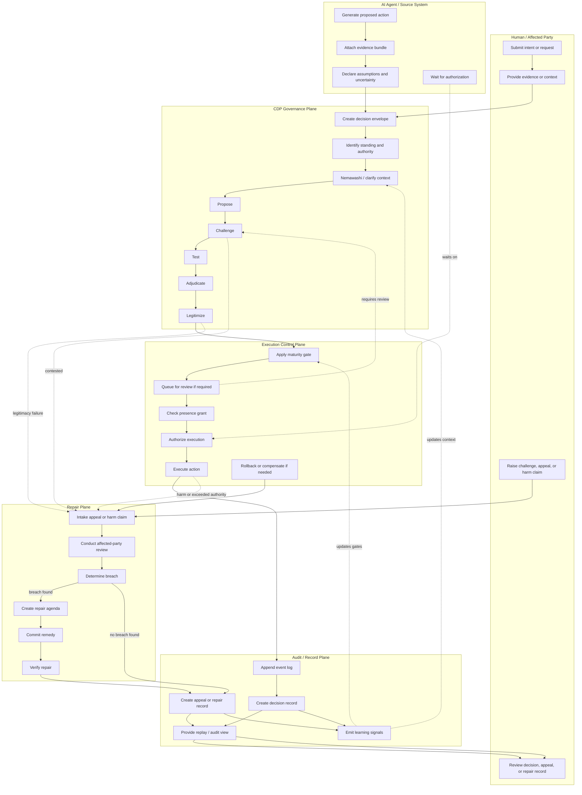

# CDP Simple Swimlane Diagram

**Status:** Draft  
**Category:** Architecture Documentation / Diagram  
**Date:** 2026-05-03  
**Related:** `docs/diagrams/cdp-data-flow-diagram.md`, `README.md`  

---

## 1. Purpose

This document provides a simple UML-style swimlane diagram for the Constitutional Decision Plane (CDP).

The goal is to show responsibility boundaries across human, AI, governance, execution, audit, and repair lanes without the full detail of the data flow diagram.

This is documentation, not an RFC.

---

## 2. Swimlane Diagram

---

## 3. Lane Responsibilities

| Lane | Responsibility |
|---|---|
| Human / Affected Party | Submit requests, supply context, challenge decisions, raise harm claims, review outcomes. |
| AI Agent / Source System | Generate proposals, attach evidence, disclose assumptions, wait for authorization. |
| CDP Governance Plane | Wrap decisions, establish standing, deliberate, test, adjudicate, and legitimize. |
| Execution Control Plane | Gate, queue, authorize, execute, rollback, and compensate. |
| Audit / Record Plane | Preserve events, decisions, appeals, repair records, replay views, and learning signals. |
| Repair Plane | Intake appeals, review harms, determine breaches, create repair agendas, verify remedies. |

---

## 4. Design Notes

- This is intentionally simpler than `cdp-data-flow-diagram.md`.
- Each Mermaid subgraph functions as a UML-style swimlane.
- This diagram emphasizes responsibility boundaries rather than full protocol detail.
- Challenge, appeal, rollback, compensation, and repair are first-class paths rather than exceptions.
- Learning is downstream of decision and repair records; it does not replace repair.
