# CDP Technology Stack Block Diagram

**Status:** Draft  
**Category:** Architecture Documentation / Diagram  
**Date:** 2026-05-03  
**Related:** `docs/diagrams/cdp-data-flow-diagram.md`, `docs/diagrams/cdp-swimlane-diagram.md`, `README.md`  

---

## 1. Purpose

This document provides a runnable technology stack map for the Constitutional Decision Plane (CDP).

The goal is to show the major CDP runtime components, the concrete local technologies that can run on a laptop, the LocalStack-emulated AWS services, and the likely cloud-managed equivalents.

This is documentation, not an RFC. It is intentionally implementation-oriented and may change as the reference implementation evolves.

---

## 2. Recommended Name

This diagram can be referred to as the **CDP Technology Stack Diagram**.

Other reasonable names:

- Runnable Technology Stack Diagram
- Local-to-Cloud Stack Map
- Deployment Substrate Map
- Storage Substrate Diagram
- Persistence Architecture Diagram

Recommended filename:

```text
cdp-technology-stack-diagram.md
```

---

## 3. Mermaid Block Diagram

```mermaid
flowchart TB
    %% Application containers
    subgraph APP[CDP Application Containers]
        API[cdp-api<br/>FastAPI / Python]
        WORKER[cdp-worker<br/>Queue Consumers]
        UI[cdp-admin-ui<br/>Review / Audit UI]
        SIM[cdp-sim<br/>Simulation / Test Harness]
    end

    %% Local laptop runtime
    subgraph LOCAL[Local Laptop Runtime]
        COMPOSE[Docker Compose]
        LS[localstack/localstack<br/>AWS Service Emulation]
        PG[pgvector/pgvector:pg16<br/>Postgres + pgvector]
        QDRANT[qdrant/qdrant<br/>Vector Search]
        REDIS[redis<br/>Cache / Short-Lived Grants]
        MIGRATE[Alembic / SQL Migrations]
    end

    %% LocalStack service map
    subgraph LSAWS[LocalStack-Emulated AWS Services]
        S3[S3<br/>Evidence + Artifact Buckets]
        SQS[SQS<br/>Review / Execution / Repair Queues]
        SNS[SNS<br/>Notifications]
        EVB[EventBridge<br/>Decision Domain Events]
        LAMBDA[Lambda<br/>Optional Async Handlers]
        SM[Secrets Manager<br/>Local Secrets]
        SSM[SSM Parameter Store<br/>Local Config]
        DDB[DynamoDB<br/>Optional Idempotency / Locks]
        SFN[Step Functions<br/>Optional Workflow Prototypes]
    end

    %% CDP responsibilities
    subgraph DATA[CDP Data Responsibilities]
        TX[Transactional Governance State]
        VECTOR[Semantic Memory / Retrieval]
        ART[Evidence + Artifacts]
        QUEUES[Governance Work Queues]
        EVENTS[Decision / Repair Events]
        CACHE[Short-Lived Grants / Sessions]
        CONFIG[Config / Secrets]
        IDEMP[Idempotency / Locks]
    end

    %% Cloud targets
    subgraph CLOUD[Cloud Deployment Targets]
        ECS[ECS / Fargate or EKS<br/>CDP Containers]
        RDS[RDS Postgres + pgvector<br/>Transactional State + Small Vector Workloads]
        QDC[Qdrant Cloud or OpenSearch Vector<br/>Larger Semantic Retrieval]
        S3C[AWS S3<br/>Artifacts / Evidence]
        SQSC[AWS SQS<br/>Queues]
        EVBC[AWS EventBridge<br/>Events]
        REDISC[ElastiCache Redis<br/>Cache / Grants]
        SECRETS[AWS Secrets Manager / SSM<br/>Secrets + Config]
        SFNC[AWS Step Functions<br/>Workflow Orchestration]
    end

    %% Compose wiring
    COMPOSE --> API
    COMPOSE --> WORKER
    COMPOSE --> UI
    COMPOSE --> SIM
    COMPOSE --> LS
    COMPOSE --> PG
    COMPOSE --> QDRANT
    COMPOSE --> REDIS
    MIGRATE --> PG

    %% App to local services
    API --> PG
    API --> QDRANT
    API --> REDIS
    API --> LS
    WORKER --> PG
    WORKER --> QDRANT
    WORKER --> REDIS
    WORKER --> LS
    UI --> API
    SIM --> API

    %% LocalStack services
    LS --> S3
    LS --> SQS
    LS --> SNS
    LS --> EVB
    LS --> LAMBDA
    LS --> SM
    LS --> SSM
    LS --> DDB
    LS --> SFN

    %% Responsibility mapping
    PG --> TX
    PG --> VECTOR
    QDRANT --> VECTOR
    S3 --> ART
    SQS --> QUEUES
    EVB --> EVENTS
    SNS --> EVENTS
    REDIS --> CACHE
    SM --> CONFIG
    SSM --> CONFIG
    DDB --> IDEMP
    SFN --> QUEUES

    %% Cloud mapping
    API -. cloud .-> ECS
    WORKER -. cloud .-> ECS
    UI -. cloud .-> ECS
    PG -. cloud .-> RDS
    QDRANT -. cloud .-> QDC
    S3 -. cloud .-> S3C
    SQS -. cloud .-> SQSC
    EVB -. cloud .-> EVBC
    REDIS -. cloud .-> REDISC
    SM -. cloud .-> SECRETS
    SSM -. cloud .-> SECRETS
    SFN -. cloud .-> SFNC
```



---

## 4. Concrete Local Stack

A first runnable local stack should probably include:

| Local Component | Suggested Technology | Why |
|---|---|---|
| API | `FastAPI` container | Simple Python service layer for governance APIs. |
| Worker | Python worker container | Consumes review, execution, repair, and replay queues. |
| Admin UI | Lightweight web container | Human review, audit, appeal, and repair operations. |
| Transactional DB | `pgvector/pgvector:pg16` | Postgres system of record with vector support available from day one. |
| Vector DB option A | `pgvector` inside Postgres | Good first implementation when vector volume is modest and joins matter. |
| Vector DB option B | `qdrant/qdrant` | Better separation for semantic retrieval and larger vector workloads. |
| Cache | `redis` | Short-lived grants, sessions, idempotency hints, rate limits, and worker coordination. |
| AWS Emulator | `localstack/localstack` | Local S3, SQS, SNS, EventBridge, Lambda, Secrets Manager, SSM, DynamoDB, and Step Functions emulation. |
| Migrations | Alembic / SQL migrations | Repeatable schema setup. |

---

## 5. What LocalStack Should Be Used For

LocalStack should emulate cloud-adjacent infrastructure, not every database.

| CDP Need | LocalStack Service | Cloud Equivalent | Notes |
|---|---|---|---|
| Evidence bundles and artifacts | S3 | AWS S3 | Store uploaded evidence, transcripts, attachments, repair artifacts, and exported records. |
| Review work queue | SQS | AWS SQS | Queue decisions needing human review or adjudication. |
| Execution work queue | SQS | AWS SQS | Queue actions that have passed maturity and authorization gates. |
| Repair work queue | SQS | AWS SQS | Queue appeals, breach reviews, remedy verification, and unresolved repair work. |
| Dead-letter handling | SQS DLQ | AWS SQS DLQ | Preserve failed review, execution, and repair work for escalation. |
| Decision domain events | EventBridge | AWS EventBridge | Publish `DecisionProposed`, `ChallengeRaised`, `ExecutionAuthorized`, `BreachRecorded`, etc. |
| Notifications | SNS | AWS SNS | Notify reviewers, auditors, or downstream systems. |
| Optional async handlers | Lambda | AWS Lambda | Prototype small event handlers without running a full worker. |
| Local secrets | Secrets Manager | AWS Secrets Manager | Store local API keys, DB passwords, and signing keys for dev. |
| Local config | SSM Parameter Store | AWS SSM Parameter Store | Store environment-level config and feature flags. |
| Idempotency / lightweight locks | DynamoDB | AWS DynamoDB | Optional: idempotency records, lease locks, replay cursors. |
| Workflow prototypes | Step Functions | AWS Step Functions | Optional: model approval, execution, and repair workflows before hardening them in code. |

---

## 6. What LocalStack Should Not Be Used For

LocalStack should not be treated as the implementation for every persistence concern.

| Need | Better Local Technology | Why |
|---|---|---|
| Transactional governance state | Postgres | Strong relational model, constraints, migrations, joins, and audit-friendly schemas. |
| Small/medium vector search | Postgres + pgvector | Keeps vectors near decision/evidence metadata. Good for early implementation. |
| Larger semantic memory | Qdrant | Purpose-built vector database with a clean local Docker story and cloud option. |
| Short-lived grants / sessions | Redis | Simple expiration, fast lookups, and worker coordination. |
| Analytical reporting | Postgres views first; warehouse later | Start simple; split only when reporting load demands it. |

---

## 7. Suggested First Docker Compose Shape

A first `docker-compose.yml` should likely include these services:

```yaml
services:
  cdp-api:
    build: .
    depends_on:
      - postgres
      - qdrant
      - redis
      - localstack

  cdp-worker:
    build: .
    command: python -m cdp.worker
    depends_on:
      - postgres
      - qdrant
      - redis
      - localstack

  postgres:
    image: pgvector/pgvector:pg16
    environment:
      POSTGRES_DB: cdp
      POSTGRES_USER: cdp
      POSTGRES_PASSWORD: cdp
    ports:
      - "5432:5432"

  qdrant:
    image: qdrant/qdrant:latest
    ports:
      - "6333:6333"
      - "6334:6334"

  redis:
    image: redis:latest
    ports:
      - "6379:6379"

  localstack:
    image: localstack/localstack:latest
    ports:
      - "4566:4566"
    environment:
      SERVICES: s3,sqs,sns,events,lambda,secretsmanager,ssm,dynamodb,stepfunctions
      DEBUG: "1"
```

This is intentionally skeletal. It should become real infrastructure only after the service names, ports, migrations, and bootstrap scripts are chosen.

---

## 8. Suggested Bootstrap Resources

LocalStack bootstrap should probably create:

### S3 Buckets

```text
cdp-evidence-local
cdp-artifacts-local
cdp-exports-local
```

### SQS Queues

```text
cdp-intake-queue
cdp-review-queue
cdp-execution-queue
cdp-appeal-queue
cdp-repair-queue
cdp-dead-letter-queue
```

### EventBridge Bus

```text
cdp-events-local
```

### Secrets / Parameters

```text
/cdp/local/database-url
/cdp/local/qdrant-url
/cdp/local/signing-key
/cdp/local/default-policy-profile
```

---

## 9. Laptop-to-Cloud Mapping

| Local Laptop | Cloud Target | Migration Note |
|---|---|---|
| Docker Compose app containers | ECS/Fargate or EKS | Keep containers portable. |
| Postgres / pgvector container | RDS Postgres with pgvector | Best early production target for transactional state. |
| Qdrant container | Qdrant Cloud or managed vector service | Use when semantic retrieval outgrows pgvector. |
| LocalStack S3 | AWS S3 | Keep bucket names environment-specific. |
| LocalStack SQS | AWS SQS | Queue contracts should not depend on LocalStack-specific behavior. |
| LocalStack EventBridge | AWS EventBridge | Domain events should be explicitly versioned. |
| LocalStack Secrets Manager / SSM | AWS Secrets Manager / SSM | Same logical parameter names across environments. |
| Redis container | ElastiCache Redis | Useful for grants, sessions, leases, and short-lived coordination. |

---

## 10. Design Position

Recommended starting posture:

1. **Postgres + pgvector first** for transactional state and modest semantic retrieval.
2. **Qdrant as a separate container** when vector search becomes its own operational concern.
3. **LocalStack for AWS-like infrastructure**, especially S3, SQS, EventBridge, Secrets Manager, SSM, and optional Lambda/Step Functions prototypes.
4. **Redis for short-lived runtime state**, not durable governance records.
5. **Append-only event tables in Postgres first**, with EventBridge used for integration events. Migrate to Kafka, Redpanda, Kinesis, or another log substrate later only if event volume demands it.

The architectural rule: keep authority, state, evidence, semantic memory, queues, and events separate enough that CDP can be audited, replayed, challenged, and repaired.
