# CDP Technology Stack Block Diagram

**Status:** Draft  
**Category:** Architecture Documentation / Diagram  
**Date:** 2026-05-03  
**Related:** `docs/diagrams/cdp-data-flow-diagram.md`, `docs/diagrams/cdp-swimlane-diagram.md`, `README.md`  

---

## 1. Purpose

This document provides a simple block diagram for the Constitutional Decision Plane (CDP) technology stack.

The goal is to show the major CDP runtime components and the likely storage substrate beneath each component.

This is documentation, not an RFC. It is intentionally implementation-oriented and may change as the reference implementation evolves.

---

## 2. Recommended Name

This diagram can be referred to as the **CDP Technology Stack Diagram**.

Other reasonable names:

- Storage Substrate Diagram
- Runtime Stack Diagram
- Persistence Architecture Diagram
- Data Store Responsibility Map

Recommended filename:

```text
cdp-technology-stack-diagram.md
```

---

## 3. Mermaid Block Diagram

```mermaid
flowchart TB
    %% External consumers
    subgraph CLIENTS[Actors and Interfaces]
        HUMAN[Human Users]
        AGENTS[AI Agents]
        SYSTEMS[Source Systems]
        AUDITORS[Auditors / Reviewers]
    end

    %% Application/API layer
    subgraph APP[CDP Application Layer]
        GOVAPI[Governance API]
        DELIBAPI[Deliberation API]
        ADMIN[Admin / Review UI]
        SIM[Simulation / Test Harness]
    end

    %% Governance services
    subgraph SERVICES[CDP Governance Services]
        ENVELOPE[Decision Envelope Service]
        IDAUTH[Identity / Attestation Service]
        POLICY[Policy and Authority Service]
        LIFECYCLE[Lifecycle Protocol Service]
        EXECCTRL[Execution Control Service]
        REPAIR[Repair / Appeal Service]
        AUDIT[Audit / Replay Service]
        LEARN[Learning / Feedback Service]
    end

    %% Storage layer
    subgraph STORAGE[Storage Substrate]
        PG[(Postgres\nTransactional State)]
        SQL[(SQL Store\nReporting / Analytics)]
        VEC[(Vector Database\nSemantic Memory / Retrieval)]
        OBJ[(Object Storage\nEvidence / Artifacts)]
        LOG[(Append-Only Event Log\nDecision / Audit Events)]
        CACHE[(Cache\nSessions / Short-Lived Grants)]
    end

    %% Queue and integration layer
    subgraph ASYNC[Async / Integration Substrate]
        QUEUE[Message Queue\nReview / Execution / Repair Work]
        DLQ[Dead Letter Queue\nEscalation / Failed Work]
        WEBHOOK[Webhooks / Event Streams]
    end

    %% Local development / deployment substrate
    subgraph LOCAL[Local Development Substrate]
        DOCKER[Docker / Compose]
        LOCALSTACK[LocalStack\nCloud Service Emulation]
        MIGRATIONS[Schema Migrations]
        SEED[Seed Data / Fixtures]
    end

    %% Client connections
    HUMAN --> GOVAPI
    HUMAN --> ADMIN
    AGENTS --> GOVAPI
    SYSTEMS --> GOVAPI
    AUDITORS --> ADMIN
    AUDITORS --> AUDIT

    %% APIs to services
    GOVAPI --> ENVELOPE
    GOVAPI --> LIFECYCLE
    DELIBAPI --> LIFECYCLE
    ADMIN --> REPAIR
    ADMIN --> AUDIT
    SIM --> LIFECYCLE
    SIM --> EXECCTRL

    %% Service dependencies
    ENVELOPE --> PG
    ENVELOPE --> OBJ
    IDAUTH --> PG
    IDAUTH --> CACHE
    POLICY --> PG
    POLICY --> VEC
    LIFECYCLE --> PG
    LIFECYCLE --> LOG
    LIFECYCLE --> QUEUE
    EXECCTRL --> PG
    EXECCTRL --> CACHE
    EXECCTRL --> QUEUE
    REPAIR --> PG
    REPAIR --> OBJ
    REPAIR --> LOG
    REPAIR --> QUEUE
    AUDIT --> LOG
    AUDIT --> SQL
    AUDIT --> OBJ
    LEARN --> LOG
    LEARN --> VEC
    LEARN --> SQL

    %% Async routing
    QUEUE --> EXECCTRL
    QUEUE --> REPAIR
    QUEUE --> DLQ
    LOG --> WEBHOOK
    WEBHOOK --> SYSTEMS

    %% Local dev wiring
    DOCKER --> GOVAPI
    DOCKER --> DELIBAPI
    DOCKER --> ADMIN
    DOCKER --> PG
    DOCKER --> VEC
    DOCKER --> QUEUE
    LOCALSTACK --> OBJ
    LOCALSTACK --> QUEUE
    LOCALSTACK --> WEBHOOK
    MIGRATIONS --> PG
    MIGRATIONS --> SQL
    SEED --> PG
    SEED --> VEC
```



---

## 4. Storage Responsibility Map

| Component | Likely Storage | Responsibility |
|---|---|---|
| Decision Envelope Service | Postgres + Object Storage | Decision metadata, envelope state, attached evidence references. |
| Identity / Attestation Service | Postgres + Cache | Identities, attestations, standing, short-lived grants. |
| Policy and Authority Service | Postgres + Vector Database | Policy rules, authority models, precedents, semantic policy retrieval. |
| Lifecycle Protocol Service | Postgres + Event Log + Queue | Decision lifecycle state, protocol events, review work items. |
| Execution Control Service | Postgres + Cache + Queue | Maturity gates, execution authorization, presence grants, pending work. |
| Repair / Appeal Service | Postgres + Object Storage + Event Log + Queue | Appeals, harm claims, breach records, repair agendas, remedy tracking. |
| Audit / Replay Service | Event Log + SQL Store + Object Storage | Replay views, audit trails, historical reporting, artifact lookup. |
| Learning / Feedback Service | Event Log + Vector Database + SQL Store | Outcome analysis, semantic memory, trend analysis, governance improvement. |

---

## 5. Technology Assumptions

This diagram assumes a pragmatic local-first implementation path:

- **Postgres** for transactional governance state.
- **SQL stores** for reporting, analytics, and replay-friendly projections.
- **Vector databases** for semantic retrieval, policy precedent search, decision memory, and evidence similarity.
- **Object storage** for evidence bundles, artifacts, transcripts, attachments, and larger immutable records.
- **Append-only event logs** for auditability, replay, appeal, and repair.
- **Queues** for review, execution, appeal, repair, retries, and dead-letter escalation.
- **LocalStack** for local emulation of cloud-like storage, queueing, and event services.
- **Docker / Compose** for local development orchestration.

---

## 6. Design Notes

- This diagram intentionally separates **state**, **semantic memory**, **evidence artifacts**, **events**, and **queues**.
- Not every component needs every database.
- Vector storage should support retrieval and memory, not become the authority of record.
- Postgres should remain the likely system of record for transactional governance state.
- Event logs should preserve what happened, not merely the latest state.
- Queues are governance infrastructure, not just async plumbing.
- Repair and appeal require durable records, not just learning signals.

---

## 7. Open Questions

1. Should the first local implementation use `pgvector` inside Postgres or a separate vector database?
2. Should the SQL reporting store initially be Postgres views/materialized views rather than a separate warehouse?
3. Should event logs begin as Postgres append-only tables and later migrate to Kafka, Redpanda, Kinesis, or another log substrate?
4. Should LocalStack be the default local substrate for object storage and queue emulation?
5. Should repair records and decision records share a common event envelope?
