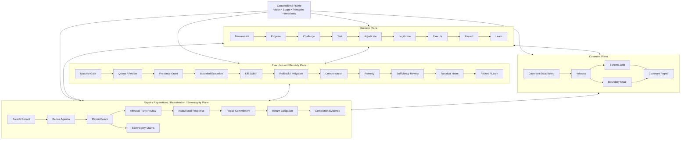
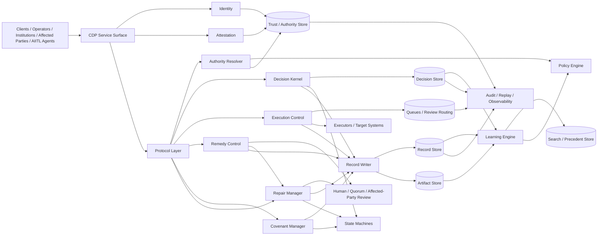
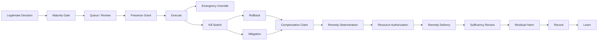

# RFC-CDP-011 — Architecture Diagrams

Author: Kevin “Andie” Williams  
Status: Draft v0.1  
Series: Constitutional Decision Plane (CDP)  
Date: May 3, 2026  
Depends On: RFC-CDP-001, RFC-CDP-010

## Abstract

This RFC provides simple Mermaid architecture diagrams for the Constitutional Decision Plane (CDP).

The diagrams are explanatory. They do not replace the normative architecture in RFC-CDP-010. If a diagram and normative prose conflict, the prose controls.

## 1. Purpose

This document gives readers a compact visual map of CDP:

- a conceptual plane diagram;
- a logical component diagram;
- an execution and remedy control path.

The diagrams are stored as Mermaid text so they remain versionable, reviewable, and editable in source form.

## 2. Conceptual Architecture

## 3. Logical Reference Architecture

## 4. Execution and Remedy Control Path

## 5. Summary

These diagrams provide a source-controlled visual reading guide for CDP.

They are intentionally simple. The architecture remains governed by RFC-CDP-010 and the protocol-specific RFCs.
